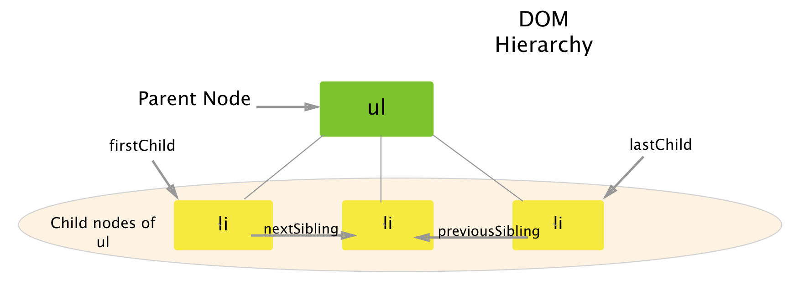

### Question:
Describe how elements are laid out in a DOM representation. Include an explanation of the parent, child, sibling relationship between DOM elements.

<h1 style="color:#3CCAE6">The DOM Tree</h1>
 

<blockquote>
  
I don't have to look up my family tree because I know that I'm the sap. 

  <small>Fred Allen</small>
</blockquote>
 
Think of an upside down tree and like a tree the DOM branches out connecting the roots to the branches. We start at the top with the `document` node which is always the first node. Much like in HTML where we have children and parent elements the same terminology can be applied here. All nodes on the same level are siblings, the node above is the parent/parents and the nodes below are those children's children. Let me better explain this with a visual representation.

Above we have a parent, child nodes and siblings corresponding to a ul and li elements.The reason we have these terms in the DOM is so we can use properties that allow us to target certain elements within other elements so knowing how they relate to each other helps us do that. I will go over each term in the diagram. 

## Parent 
A node is considered a parent if it is above another node. The ul is the parent of the li nodes because it is one level higher. 

<button type="button" class="close" data-dismiss="alert">&times;
</button>
<strong>Heads up!</strong>  There is always a document node in the DOM. It is the top most node and is the parent to all nodes in any DOM tree. It is known as the Ancestor node.

## Child
The li nodes are the children nodes of the ul. Any node below a node is a child of the above node.

## Sibling
A sibling is any two or more nodes that share the same parent. The li nodes are all siblings because they share the ul node. The `previousSibling` and `nextSibling` are properties of the DOM that allow us to target the next or previous sibling.

<h1 style="color:#3CCAE6">Summary</h1>

We went over the DOM tree hierarchy, showing how each element is related to one another and how by knowing this relation we can target nodes with properties that we will discuss in another article. 

 
 

