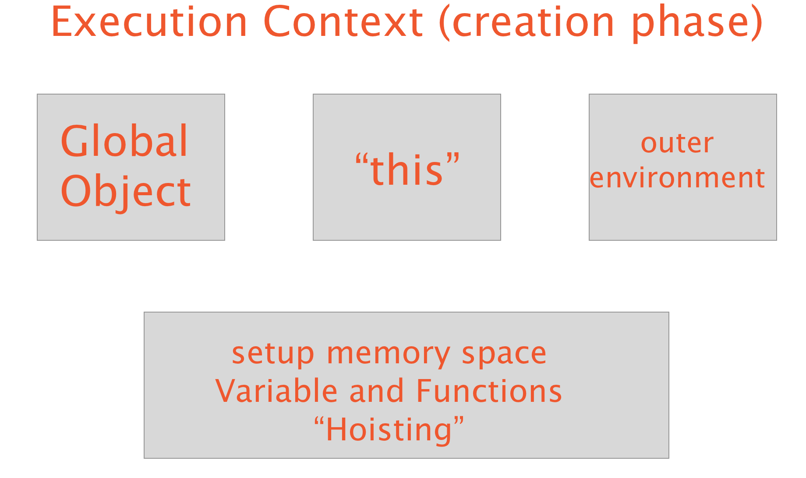

### Question:
Describe what JavaScript variable hoisting is and its significance in how and where variables should be declared. Use at least one example to demonstrate variable hoisting.

<hr>

<h1 style="color:#3CCAE6">Execution Context</h1>

Before you can understand what hoisting is you must first understand how the JavaScript engine reads the code you write. When you run your code
what happens behind the scenes is an execution context is created. There are two phases to this execution context: the creation phase and the execution phase.



During the creation phase a global object, the `this` reference, an outer environment and the memory space for variables and functions known as "hoisting" are created. This all happens before
the code begins to read line by line. The global object is the window object if we run it in the browser and the `this` refers to that window object unless altered. The outer environment is
created for variables and functions created inside other functions but won't apply to our example.

Now this brings us to the the last part of the creation phase:

<h1 style="color:#3CCAE6">Variable Hoisiting</h1>

For our purposes, we are going to focus on the global scope when it comes to the execution context for this article.
It's not just variables that get hoisted but also functions but the difference lies in how JavaScript holds them in memory. During the creation phase, JavaScript reads through the code
gathering all the variables and functions in the global scope and sets them to memory. Variables get set to `undefined` in memory while functions are put in memory in their entirety.
It's only when the code starts being read line by line in the execution phase that variables are given their value.

This is where things can go wrong because if you try to do anything with a variable before it has been parsed you're going to get `undefined`.

<a href="http://jsbin.com/mikire/edit?js,console" class="btn btn-link" target="_blank" style="font-size:16px">Checkout this Jsbin to show this example</a><br>

```javascript
b(); // will return the string within the function below

console.log(a); // will return undefined because it doesn't read the 'var a' line first

var a = "I'm a variable in I'm put into memory as undefined until read";

function b() {
    console.log("I'm a function in im put into memory")
}

console.log(a); // log a over here and we get what we expect
```

This example shows why we can't rely on JavaScript hoisting when it comes to variables and should not use variables in the global scope if possible for this reason.
If you must use global variables declare them at the top of your code but this goes with all your code even the variables in your function should be declared at the top of their lexical scope
to avoid this problem.

<h1 style="color:#3CCAE6">Summary</h1>
By now you should have a better understanding of variable hoisting and how it works when it comes to the execution context.

<br>
<br>