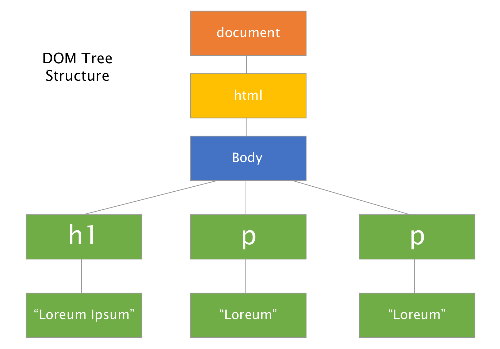

### Question:
Describe what the DOM is and explain its function.

<hr>

<h1 style="color:#3CCAE6">What's the DOM?</h1>

The DOM(document object model) was invented by Netscape in the mid 90's to speed up page rendering and allow developers to manipulate nodes on the web page.
Think of the DOM as an upside-down tree, each individual element being a node, that is branched all the way down.

```html
<html>
<body>
    <h1>Lorem ipsum</h1>
    <p>Lorem</p>
    <p>Lorem</p>
</body>
</html>
```

The code above translated to DOM format.



We start with the document node which is always at the top progressing down till we get to the individual element nodes of h1 and the two p tags. As you may have noticed even the
text have their own nodes. All of this allows us to add or change these values with any scripting language. In our case, that language is JavaScript which really makes the DOM come to life.


<h1 style="color:#3CCAE6">Live By Example</h1>

You might be wondering by now ok cool so how would I actually change something on a page using the DOM. Well there a lot more to it then a few commands but I'll give you a taste of what can be
done.

```html
<html>
<body>
<div id="container"></div>

// JavaScript code that uses the dom
<script>
  var container = document.getElementById("container");
  container.innerHTML = "New Content!";
</script>

</body>
</html>
```
Now in the DOM we have "New Content!" within the div. Now you won't see these changes in the example provided below  but if you run this code in a browser you will see this text appear.

<a href="http://jsbin.com/dojito/edit?html,js,console" class="btn btn-link" target="_blank" style="font-size:16px">Checkout this Jsbin to show this example</a><br>


<h1 style="color:#3CCAE6">Summary</h1>

This article went briefly over what the DOM is and by no means is extensive. There is a lot more to know about it but now you have a good idea what it is used for.

<br>