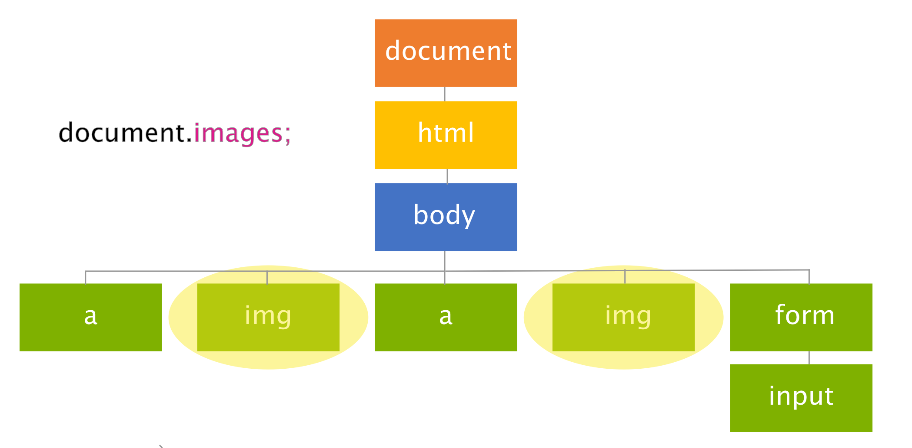

### Question:
Explain what a NodeList is and describes examples of NodeLists that can be accessed directly on the document object (like images, forms, and anchors for example).

<hr>

<h1 style="color:#3CCAE6">What's that: NodeList</h1>

A NodeList is a list of nodes which sounds kind of redundant when I say that but the usefulness lies in what we can do with this DOM object when selecting nodes. The ability to select a list of nodes gives us the ability to select all of those types of nodes from the document in return them. 

Introduced with the Level-0 DOM were five objects: `document`, `history`,`window`, `location`, and `navigator` to give us access to their NodeList. I will discuss mainly the document as it's the must commonly used. 

The `document` object was used with Arrays to give it access to NodeList of various elements. There is a Images, Forms, Anchors, Links, and Applets array. The Applets is no longer used though because it has been deprecated with HTML5. By using these arrays with the document object we can use NodeList in useful ways. 

You can think of NodeList as though they were classes like we use in CSS. It's a way the DOM differentiates between all the nodes and only returns those that go by that name or type which we can then alter all at once. To illustrate the image below shows how by using the images array we in effect get a NodeList of all of those nodes.



The yellow ovals around the image nodes show us they are selected. If we had more images they would also be selected no matter where they are in the document.

 <h1 style="color:#3CCAE6">Live By Example</h1>

 There are many other ways we can use this NodeList with other properties you might be familiar with. 

```javascript
// returns a nodeList of all images in document
document.images;

// returns how many images are in document
doucment.images.length;

// uses the name property of image to return that specific image
document.images['mainHeader'];

// can change the image by changing it source 
document.images['mainHeader'].src = "../img/supergirl.jpg";
```

Forms and anchors use similar properties:

```javascript
//selects all anchors
document.anchors;

// selects all forms
document.forms;

//returns number of forms
document.forms.length;

//returns number fo anchors in document
document.anchors.length;
```


 <h1 style="color:#3CCAE6">Summary</h1>

 I went over what the NodeList is and why it proves useful when it comes to selecting nodes in the DOM and while not extensive gives you a good idea what its used for. Now you have a better understanding you can use this object in your code.  

 <br>
 <br>