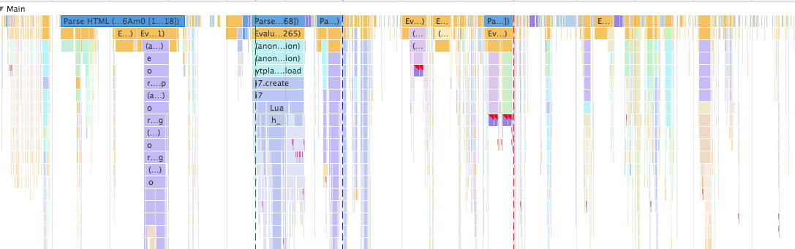
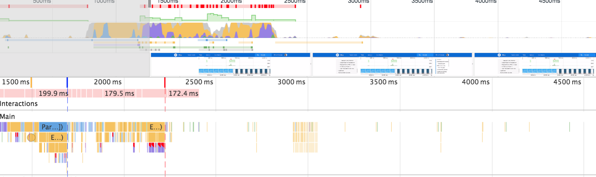

### Question:
Describe the different capture categories of the Timeline tab (ie. 'JS Profile', 'Memory', etc).

<h1 style="color:#3CCAE6">Timeline Tab</h1>

The timeline tab is used for to analyize all the activity that takes place on your website, to see how it performs which can help iron our performance issuse. There are different processes that are recorded which you can check and uncheck if you would like to not include that information. These include: Network, Js Profile, Screenshots, Memory, and Paint. 

      

image of timeline categories

I will go over all these categories below shorly pointing out the main uses but not an in-depth view of each.

<h1 style="color:#3CCAE6">Network</h1>

The network box allows us to speed up the network interactions.

<h1 style="color:#3CCAE6">JS Profile</h1>

If JS Profile tab is checked our recording will return all the Javascript functions that where called. If we hover over anyone we can see the runtime of that function. 

      

image of Javascript Stack

<h1 style="color:#3CCAE6">Screenshots</h1>

You can capture screenshots with this box checked and will return what is known as a Filmstrip back. It will also give information as to how quickly the pages load and in what order at the bottom of the Filmstrip.

 
 

      

image of Screenshot Category

<h1 style="color:#3CCAE6">Memory</h1>

The memory category allows us to find memory leaks that we may have in our application which is important for application performance.

<h1 style="color:#3CCAE6">Paint</h1>

Paint is used to improve animation performance as sometimes it will be lagging or weird glitches can happen. 