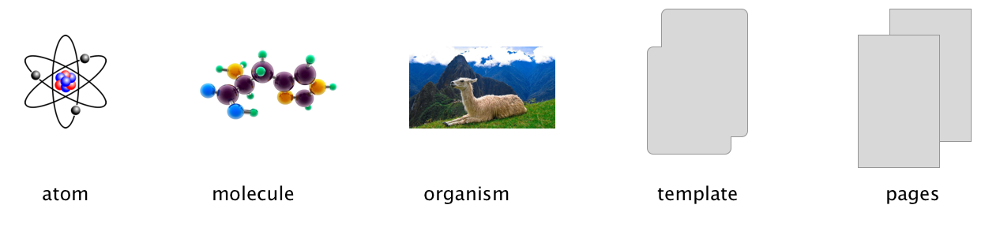

### Question:
Describe the Atomic Design Approach in detail.

<h1 style="color:#3CCAE6">Atomic Design</h1>

It's a method that is at the core of what style guides are built upon. Atoms compose the smallest part of an element- for our purposes let's consider them the smallest- then we have molecules, orgainisms, templates then pages.

 <figure>
 
  <figcaption style="text-align: center; font-weight: bold">Atomic Design Stages</figcaption>
</figure>

 

The diagram above illustrates these steps let's break each step into there own parts so that we can better show how each part makes the final site. 

<h2 style="color:#3CCAE6">Atom</h2>

Atoms pertain to the smallest parts of functional html elements like input, buttons, and labels. They can stand on there own but don't really do anything useful by themselves. 

<h3>Examples of Atoms:</h3>

Input:

    <input type="text" placeholder="type here">

Button:

<input type="button" name="test" value="Search">   

Link:

<a href="http://google.com">Click Me</a> 

<h2 style="color:#3CCAE6">Molecules</h2>

When atoms come together they form molecules - think of these as a button with an input etc. So with this in mide we could say that to qualify as a molecules you have to have at least two atoms together to form a molecule. 

<h3>Examples of a molecule:</h3>

    <input type="text" placeholder="type here">

<input style="display:inline-block;" type="button" name="test" value="Search">   

 

<h2 style="color:#3CCAE6">Organisms</h2>

Organisms a step up from molecules in that they are usually much larger and they carry out sole specific purpose such as a sign up form or a banner. 

<h3>Example of an organism:</h3>

   <input type="text" placeholder="first name">

    <input type="text" placeholder="last name">

<input style="display:inline-block;" type="button" name="test" value="Login">

    <a style="margin-left: 5px">Already a User?</a>
    <a style="margin-left:10px">Checkout As guest?</a>

<h2 style="color:#3CCAE6">Templates</h2>

When we get to this stage we have something that look like a  rough draft of our site. Where concerned more with the placement of elements and how they are going to to fit on the final draft. Styling or content is not important here.

<h2 style="color:#3CCAE6">Pages</h2>

Yes we made it to the end of our final webpage. We take our template and add styling and content to give it the final polish that we would call done in most regards. 

<h1 style="color:#3CCAE6">Summary</h1>

We have reached the end of this article I hope that I have explained this clearly the atomic mindset when developing a webpage. 

 