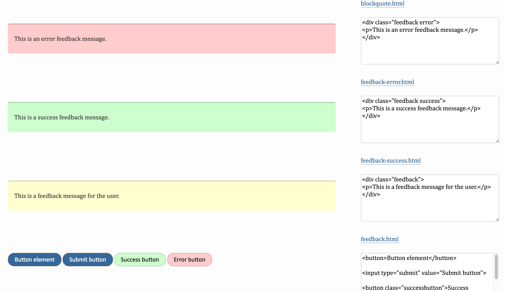

### Question:
Describe what a style guide is. Explain some of the problems having a style guide solves and the scenarios in which a style guide is most appropriate.

<h1 style="color:#3CCAE6">What's a Style Guide</h1>

A style guide is like a visual guide of various html parts such as colors, inputs,gird systems etc. This helps a large team of developers and designers to stay on the same page and also speed development. 

Example of Style Guide
 

<h1 style="color:#3CCAE6">Problems with A Style Guide</h1>

A style guide needs to be updated to keep up with best practices or to keep a modern look. The problem with this is that it's not very easy to do this quickly so it can take a long time taking developers away from working on more important task.

They also take a lot of development time when creating one from scratch. This also follows in line with the previous problem in that your initial time is going to be building a guide instead of with the real website or in the creation of the website which could lead to missing deadlines. 

Another diadvantage is that it won't benefit a small team because it just adds too much work to a project. Within a small team it's easier to communicate these details were other wise a style guide would get in the way. 

<h1 style="color:#3CCAE6">When to Use</h1>

A style guide should be used when your working on a large team/website where the styling of the site could start to take on different looks if people aren't following certain guidelines. 