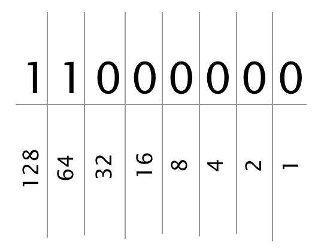

### Question:
Describe the Internet Protocol and explain how its addressing system works.

<h1 style="color:#3CCAE6">What it is and how it works</h1>

The internet protocol lays the foundation on which the internet is built upon by assigning different addresses to devices on the same network so that information knows where to return to when it has been sent from one of the billions of networks.

We need IP addresses for this system to work though and that's where IPv4 and IPv6 come to the rescue. The version mainly used is IPv4(IP version 4) which is written with 32 bits. You might have seen similar IP addresses that look like-`192.168.1.10`- this is an IPv4 address. 

See the computer doesn't really read `192.168.1.10` like that, it has to turn it into 0's and 1's which is known as binary.   

    

    <h3 class="panel-title" style="font-variant: small-caps;letter-spacing: 1px;">In-depth Lesson</h3>
    

    

    Binary can be easily explained with an example let's use 192.168.1.10 for our explanation. Computers can only read 0's and 1's so when it sees the metioned ip address it reads it as: <strong>11000000.10101000.00000001.00001010</strong>   
    
Now you might wondering how 11000000 is equal to 192 and that is the question I am going to answer. When we deal with binary we start on the right side and then starting with 1 the next number is 2 then we double from there.

<figure style="margin: 0 auto;width:300px;outline: 1px solid black;">
  
  <figcaption>
    binary value from right to left
  </figcaption>
</figure>  
    
    
Where ever there is a one that means true, where there is a zero that means false so we don't count it. We can see from the image above that we have a one in the 128 value and a one in the 64 value which when added together(128 + 64) we get 192. This is how the computer interprets the IP address and that's why we call it 32 bit because  8-bit times 4 = 32 bits.

    

IPv4 can only support up to 4.3 billion devices and we have surpassed that amount already that is why IPv6 was introduced. It can support up to 340 undecillion devices but the transition to IPv6 will take some time before it is fully implemented.

This is nice but when dealing with so many devices there needed to be a way for organizing networks into their own subnets- **IP Subnetting**.

<h1 style="color:#3CCAE6">IP Subnetting</h1>

On your home network, your router is given a private IP address- this is the address that is global and the devices on the subnet are given private IP addresses. For packets to be passed from two connections it needs the subnet and device location so it knows where to send the packets. 

This done by using the router's public IP address. Let's say that your router IP address is `192.168.1.1` and all devices on your network have a subnet of `192.168.1`. This means that the last octet is for the individual device on your network. How the router knows all this beforehand is that it is assigned a **subnet mask**.   

<h1 style="color:#3CCAE6">Summary</h1>

I hope that this has made things clearer on how the IP protocol works in helping communicate between devices.
